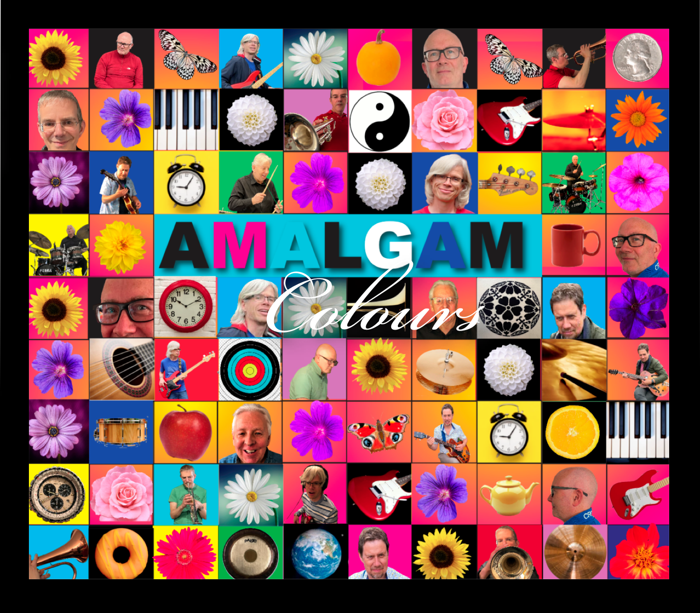

---
# Feel free to add content and custom Front Matter to this file.
# To modify the layout, see https://jekyllrb.com/docs/themes/#overriding-theme-defaults

layout: about
title: HOME
---

<h2>HOME</h2>

Our next live dates are...

[Hot Box Live](https://www.hotboxlive.co.uk/) in Chelmsford, Essex on **Saturday February 7th 2026. Doors open 2pm.** Tickets £11. Click [here](https://dice.fm/event/xe7v3e-amalgam-7th-feb-hot-box-chelmsford-tickets?pid=5d5a7e86&utm_medium=partners_api) to buy. *28-29 Viaduct Road, Chelmsford, Essex, CM1 1TS.*

[Patch](https://www.patchcolchester.co.uk/events) in Colchester, Essex on **Friday March 27th 2026. Doors open 7pm.** Tickets £10. Click [here](https://good-show.co.uk/events/3039) to buy. *24 Trinity Street, Colchester, CO1 1JN.*

{:class="img-responsive"}

Formed during the Covid pandemic, Amalgam managed to play together virtually from their homes using music software similar to Zoom. 
Over this time they wrote much of the material for their first album "Colours", which they released in 2023. 
To date they've played their original tunes as well as a broad array of jazz standards at local venues.  They're presently working on new material which they look forward to playing at a venue near you very soon! 

For bookings and general enquiries please go to our [Contact page](contact.html). 
