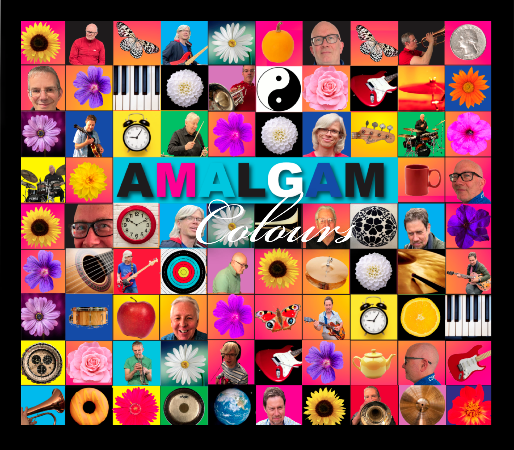

---
# Feel free to add content and custom Front Matter to this file.
# To modify the layout, see https://jekyllrb.com/docs/themes/#overriding-theme-defaults

layout: about
title: HOME
---

<h2>HOME</h2>

Our next live dates are...

[Priory Park](https://www.visitsouthend.co.uk/event/music-in-the-park-2026/) in Southend, Essex on **Sunday May 10th 2026, 3.00pm to 4.30pm**. Free entry. *Victoria Avenue, Southend-on-Sea, Essex, SS2 6NB*

[Jazz 825](https://jazz825.co.uk/) at the **Park Inn** in Southend, Essex on **Wednesday June 24th 2026, 8.30pm start**. Free entry (donations welcome). *Park Inn Hotel, Church Road, Southend-on-sea, SS1 2A*.

{:class="img-responsive"}

Formed during the Covid pandemic, Amalgam managed to play together virtually from their homes using music software similar to Zoom. 
Over this time they wrote much of the material for their first album "Colours", which they released in 2023. 
To date they've played their original tunes as well as a broad array of jazz standards at local venues.  They're presently working on new material which they look forward to playing at a venue near you very soon! 

For bookings and general enquiries please go to our [Contact page](contact.html). 
